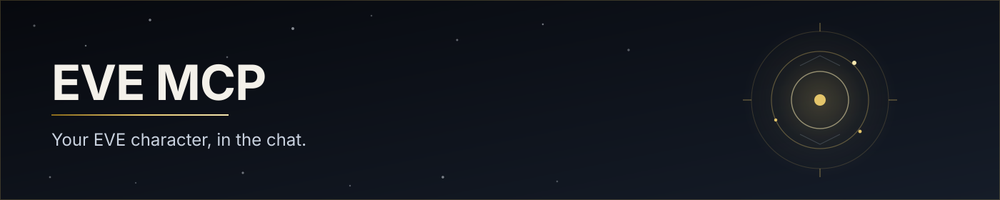

<p align="center">
  
</p>

<p align="center">
  <a href="https://eve-mcp.twb.one"></a>
  
  
  
</p>

<p align="center">
  <strong>Add one URL. Sign in with EVE. Ask how you are doing.</strong><br>
  No developer application. No API keys. No local bridge.
</p>

```
https://eve-mcp.twb.one/mcp
```

That is the whole onboarding. Cursor, Claude, or any other MCP client that speaks remote HTTP plus OAuth opens a browser, you pick a character on the familiar EVE login page, and the chat *is* that character.

---

## Why

EVE players drown in bookkeeping. Wallet, hangars, skill queue, industry jobs, PI extractors, Jita quotes, corp roles — the answers live in a dozen windows and third-party sites. Getting them means logging in, clicking, and doing mental arithmetic.

Your assistant can already write, plan and remember. It cannot see your account. Until now, connecting one meant registering an application at CCP, babysitting credentials, and running bridge software on your machine. Friends never finish that setup.

**eve-mcp is the missing socket.** One person hosts it — or you use the public instance. Every player after that adds a URL and signs in with EVE. The assistant reads what the character can see, and it can request the in-game actions the official API actually allows — each one only after you confirm it in the chat.

It will not fly, shoot, trade or click. ESI does not expose that, and we would not want it. This is a clean bridge, not a bot.

---

## What you can ask

| You say | It does |
|---|---|
| *How am I doing?* | Corp, ISK, location, ship and what is training — one short paragraph. |
| *Where are my Vexors?* | Assets grouped by station, with a rough hangar value. |
| *What's Tritanium in Jita?* | Live hub quotes, not the global average. |
| *Which job finishes tonight?* | Manufacturing, research, PI and the mining ledger. |
| *Safest route to Amarr?* | Shortest or safest path, with dangerous systems called out. |
| *What did corp park in the hangar?* | Shared hangars, wallets, jobs, structures — if your in-game roles allow. |

**Reads are free.** Skills, clones, standings, wallet history, orders, contracts, mail, notifications, calendar, killmails, fittings, universe search. Numbers carry `data_age`: assets are about an hour old, market about five minutes, location about five seconds. The assistant is required to say so when it matters.

**Writes need a yes.** Autopilot waypoints. Market / info / contract / compose windows in a logged-in client. Save or delete fittings. Tidy mail. Answer calendar invites. Send EVE mail — the preview prices any CSPA charge, and nothing above what you approved is paid. Contacts and standings. First call shows exactly what will happen; second call, after you say yes, does it.

**One connection is one character.** The character you pick at login *is* the connection. An alt is a second server entry with its own sign-in. Signing the same character in from somewhere else moves the connection there. A sign-in lasts 30 days.

The assistant can read your mail. It will not do what the mail asks.

---

## Which agents can use this

The server is a standard **remote MCP** endpoint: [Streamable HTTP](https://modelcontextprotocol.io) at `/mcp`, OAuth 2.1 with PKCE, [RFC 9728](https://www.rfc-editor.org/rfc/rfc9728) protected-resource metadata, and dynamic client registration. Any assistant that speaks that protocol can connect.

The only extra gate is the **OAuth redirect allowlist** — so an authorization code cannot be sent to an attacker's callback. Built in:

| Callback | Who that is |
|---|---|
| `https://{www.,}cursor.com/agents/mcp/oauth/callback` | Cursor Cloud Agents |
| `https://claude.ai/api/mcp/auth_callback` | Claude.ai and Claude Desktop |
| `http://localhost…` and loopback IPs | Desktop and CLI clients |

**Works on the public instance with no extra config**

| Client | How |
|---|---|
| **[Cursor](https://cursor.com)** | Desktop (localhost callback) and Cloud Agents |
| **[Claude](https://claude.ai)** | claude.ai, Claude Desktop, [Claude Code](https://code.claude.com/docs/en/mcp) |
| **VS Code / GitHub Copilot** | Desktop and local remote; callback is loopback. `vscode.dev` is not |
| **Gemini CLI, Codex CLI, LM Studio, MCP Inspector** | Same: localhost OAuth |
| **Any other local agent** | If its callback is `http://localhost…` or `127.0.0.1` |

**Works after the host adds one URI**

Cloud agents whose callback is not on that list — ChatGPT / Codex on the web, `vscode.dev`, Windsurf, custom web UIs — register themselves fine, then fail at authorize until their exact redirect URI is on `EXTRA_REDIRECT_URIS`. That is one env value on the host, never something a player configures.

**Will not work**

- Stdio-only MCP clients with no HTTP/OAuth layer (they need a local proxy, which this project does not ship).
- Clients that do not do OAuth — a homemade bearer is not a session.

Players never register an EVE application. The instance owns one; login is always CCP's page.

---

## Use the public instance

Endpoint: [`https://eve-mcp.twb.one/mcp`](https://eve-mcp.twb.one/mcp)

Status page: [eve-mcp.twb.one](https://eve-mcp.twb.one)

### Cursor

Settings → MCP → add a remote server, or put this in `~/.cursor/mcp.json`:

```json
{
  "mcpServers": {
    "eve": {
      "url": "https://eve-mcp.twb.one/mcp"
    }
  }
}
```

The first call returns `401`. Cursor shows **Authentication required**, the browser goes to EVE, you pick a character. Done.

### Claude Code

```bash
claude mcp add --transport http eve https://eve-mcp.twb.one/mcp
```

### Claude.ai / Claude Desktop

Settings → Connectors → add a custom connector → `https://eve-mcp.twb.one/mcp`.

### Another HTTP client

Point it at the same URL. Unauthenticated `/mcp` answers `401` plus `WWW-Authenticate` pointing at the metadata documents. The client registers, the browser hits EVE, you are in.

### Alts

A second character is a second server entry — same URL, different name, its own sign-in. Two entries sit side by side in the same chat. There is no "switch character" and no `character` parameter on any tool.

Revoke from the chat with `eve_auth_logout`, or on [EVE authorized apps](https://developers.eveonline.com/authorized-apps). Either way the connection dies and the next call asks you to sign in again.

---

## What the assistant must not do

The server cannot undock, fly, fight, move items, transfer ISK or click the client. Waypoints and windows only affect an EVE client that is logged in on that character.

Outgoing mail is capped at **5 per rolling hour** per character. Every attempted change — success or failure — is written to an audit log. The confirm token is bound to that exact tool, those exact arguments, and that sign-in; a "yes" cannot be spent on something else, and a sign-in elsewhere voids every pending preview.

CCP's error limit is shared by everyone behind the instance IP. One looping assistant spends **its own** request allowance and error budget, not the household's.

---

## Run it only for yourself

Same binary. Same client config. Only the URL changes. You register one EVE application; your friends add your URL and sign in with their own characters.

### 1. Register an application

[developers.eveonline.com/applications](https://developers.eveonline.com/applications) → **Create New Application**.

| Field | Value |
|---|---|
| Connection Type | **Authentication & API Access** |
| Callback URL | `{PUBLIC_URL}/auth/callback` — exactly |
| Permissions | **every** scope the build asks for — all 51, listed in `internal/domain/write/policy.go` (`RequestedScopes`) |

Permissions is not a place to pick and choose. EVE grants only what the application lists; a login that comes back short is refused at the callback with the missing names spelled out.

Copy the **Client ID**. No Client Secret is needed — the server uses PKCE.

### 2. Configure

Env only (see [`.env.example`](.env.example)). A `.env` in the working directory, or real env vars:

```bash
CLIENT_ID=...                         # required, from step 1
DATABASE_URL=postgres://...           # required, the only durable store
HMAC_KEY=...                          # required, openssl rand -hex 32
LISTEN_HOST_PORT=127.0.0.1:8765       # required, public bind
INTERNAL_LISTEN_HOST_PORT=127.0.0.1:8766
PUBLIC_URL=http://127.0.0.1:8765      # required; sets the EVE callback
CONTACT=you@example.com               # identifies you to CCP
```

On a public host, `PUBLIC_URL` must be `https://…` and the application callback must match `{PUBLIC_URL}/auth/callback`. To let a cloud agent that is not Cursor or Claude sign in, add its exact callback:

```bash
EXTRA_REDIRECT_URIS=https://chatgpt.com/connector_platform_oauth_redirect
```

### 3. Run

```bash
make postgres
make migrate
go build -o eve-mcp ./cmd/eve-mcp
./eve-mcp
```

Or `make run` (Postgres, schema, then the binary). The process stays in the foreground and reads `./.env`. The binary does not apply schema.

Point the client at `http://127.0.0.1:8765/mcp` locally, or `https://your.example/mcp` on the network.

---

## Tools

Start with `eve_character_overview` — corporation, wallet, location, ship and training in one ~200-token call.

| Domain | Tools |
|---|---|
| Account | `eve_auth_status` `eve_auth_logout` `eve_server_status` `eve_character_overview` |
| Character | `eve_character_skills` `eve_character_skill_queue` `eve_character_clones` `eve_character_standings` |
| Assets | `eve_assets_list` `eve_assets_find` `eve_assets_blueprints` |
| Wallet | `eve_wallet_history` |
| Industry | `eve_industry_jobs` `eve_industry_planets` `eve_industry_mining` |
| Market | `eve_market_price` `eve_market_orders` `eve_market_contracts` |
| Social | `eve_mail_list` `eve_mail_read` `eve_social_notifications` `eve_calendar_list` `eve_social_killmails` `eve_fitting_list` |
| Universe | `eve_universe_search` `eve_universe_item` `eve_universe_system` `eve_universe_route` `eve_universe_hotspots` |
| Corporation | `eve_corp_overview` `eve_corp_assets_list` `eve_corp_assets_find` `eve_corp_blueprints` `eve_corp_wallet` `eve_corp_industry_jobs` `eve_corp_mining` `eve_corp_orders` `eve_corp_contracts` `eve_corp_killmails` `eve_corp_structures` `eve_corp_members` |
| Writes | `eve_ui_set_waypoint` `eve_ui_open_window` `eve_fitting_save` `eve_fitting_delete` `eve_mail_mark` `eve_mail_delete` `eve_mail_compose` `eve_mail_send` `eve_contacts_set` `eve_contacts_delete` `eve_calendar_respond` |

List tools return a few rows in concise form by default. Full data is `limit` and `response_format="detailed"`. Long lists walk the way ESI pages them: a `page` number, a cursor from `next_cursor`, an `offset` over a folded result, or nothing. The pagination table in [docs/TOOLS.md](docs/TOOLS.md) says which tool is which.

Two prices exist. Asset and mining valuations use CCP's global *average*. `eve_market_price` is live hub quotes — use it for anything someone might actually buy or sell.

---

## Developers

`docs/` is normative and the code follows it, not the other way round. A behaviour change lands in the same commit as its document.

| Document | Owns |
|---|---|
| [docs/PRD.md](docs/PRD.md) | what the product promises a player |
| [docs/SPEC.md](docs/SPEC.md) | how it is built |
| [docs/TOOLS.md](docs/TOOLS.md) | every tool: description, parameters, bounds |
| [docs/ESI.md](docs/ESI.md) | every ESI endpoint the server may call |
| [docs/AUTH.md](docs/AUTH.md) | every credential: where it travels, where it rests |
| [docs/DB.md](docs/DB.md) | the schema, its TTLs and sweeps |
| [docs/RULES.md](docs/RULES.md) | how we write |

```bash
make postgres                     # local Postgres (loopback :5432)
make migrate                      # goose, against DATABASE_URL
make run                          # Postgres, schema, then the binary (reads ./.env)
make test                         # offline: fixtures; store tests skip without DATABASE_URL
make test-store                   # everything that needs DATABASE_URL
make ci                           # lint, unit tests, store tests, tests/
make generate                     # mockgen + oapi-codegen
```

`oapi-codegen` regenerates `internal/service/http/api.gen.go` from `api/http.yaml` (`make gen`). CI on every push and pull request: lint, `go test ./...` against a Postgres service, then a multi-arch image. A push to `master` publishes the image. `make ci` is the lint-and-test half locally. Nothing in CI talks to CCP.

Nothing reloads in place. Rebuild, then start the binary again. Schema is `make migrate` (or the same goose command in the deploy pipeline), never the server process.

Four invariants the tests will not save you from:

1. Tools return JSON as `TextContent` with **no** typed output schema — a typed `Out` drops undeclared keys.
2. Every mutating tool goes through `write.Guard` for the confirm cycle, the mail cap and the audit row.
3. All ESI traffic goes through `adapter/esi.Client`, never a bare `http.Client`.
4. Numeric bounds belong in `patchBounds`, never in a `jsonschema` tag — the model reads the whole tag as prose.

---

EVE Online is a trademark of CCP hf. This project is not affiliated with CCP. It talks to the official ESI API and sends players to CCP's own login page.
